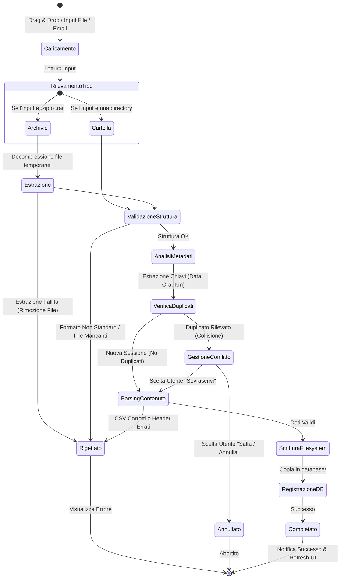

# Specifiche di Importazione File TGM (Track Geometry Measurement)

Questo documento definisce le specifiche tecniche, i canali di caricamento e la macchina a stati per l'importazione delle sessioni di rilievo nel modulo **TGM Visualizer** di RailPulse / WebOne.

---

## 1. Canali di Importazione

Il sistema deve consentire l'importazione delle acquisizioni attraverso tre modalità distinte:

1. **Trascinamento (Drag & Drop) sulla Card "TGM SESSION DATABASE"**:
   - L'utente trascina una cartella di acquisizione o un archivio compresso (`.zip`/`.rar`) direttamente sull'area della card nella dashboard.
   - *Importazione Multipla*: È possibile trascinare contemporaneamente più cartelle di acquisizione valide (Multi-Cartella). In questo caso, le cartelle vengono accodate dal frontend e inviate/processate dal backend **in sequenza** (una alla volta). Il ciclo di validazione, controllo duplicati e registrazione descritto nella macchina a stati viene ripetuto in maniera indipendente per ciascuna cartella.
   - *Feedback Visivo*: Durante il trascinamento, l'interfaccia attiva un overlay visivo con la scritta "Rilascia per importare", confermando la correttezza dell'area di rilascio.
   - Utilizzo delle API del browser (`DataTransferItem.webkitGetAsEntry()`) per scansionare ricorsivamente la struttura in caso di cartella.
2. **Pulsante "Import File"**:
   - Un pulsante puramente testuale (senza icone decorative) che apre un menu a tendina.
   - Permette la selezione sia di archivi compressi (`.zip`, `.rar`) sia di intere cartelle locali (sfruttando gli attributi `webkitdirectory directory multiple` sull'input HTML).
3. **Ricezione via Mail (In un secondo momento)**:
   - Un servizio in background (IMAP listener o webhook dedicato) monitora una casella postale specifica.
   - All'arrivo di una mail contenente un allegato compresso, estrae il file ed esegue la macchina a stati di importazione in modalità non interattiva.

---

## 2. Macchina a Stati del Processo di Importazione

Il ciclo di vita dell'importazione è regolato dalla seguente macchina a stati:



---

## 3. Dettaglio degli Stati e Logica di Validazione

### Stato 1: Caricamento e Rilevamento Tipo
- L'utente fornisce i file. Il frontend o il backend analizza l'estensione o l'entry type:
  - **Directory**: Se è una directory, si ottiene la lista dei file preservando la struttura relativa dei percorsi (es. `NomeCartella/file.csv`).
  - **Archivio (ZIP/RAR)**: Se è un file compresso, viene caricato temporaneamente lato server.
  - **File sfusi**: Se vengono caricati 3 file CSV singolarmente fuori da una cartella, il sistema tenta di ricostruire la sessione se i nomi dei file contengono un timestamp coerente.

### Stato 2: Estrazione e Preparazione
- Gli archivi compressi vengono estratti in una directory temporanea sul server per analizzarne il contenuto.
- Se l'estrazione fallisce o l'archivio è corrotto, il processo si interrompe segnalando l'errore e procedendo alla rimozione immediata sia dell'archivio caricato sia di eventuali file parzialmente estratti per non lasciare residui nel sistema.

### Stato 3: Validazione Struttura (Verifica Formato Standard)
Il sistema verifica se la cartella caricata (o estratta) corrisponde a un'acquisizione TGM standard.
1. **Verifica Nome Directory**: Il nome della cartella principale deve rispettare l'espressione regolare:
   ```regex
   ^(\d{4}\.\d{2}\.\d{2})\s+(\d{2}\.\d{2}\.\d{2})K(\d{3}\+\d{3})~K(\d{3}\+\d{3})$
   ```
   *Esempio valido*: `2026.02.27 00.22.18K100+000~K102+500`
   - Se il nome della cartella **non** rispetta il formato, il sistema non la riconosce come acquisizione valida e viene **Rigettato**.
2. **Verifica File Interni**: All'interno della cartella devono essere presenti **esattamente 3 file CSV** con le desinenze cinesi specifiche per i report TGM:
   - `*超限報表.csv` (Report Eccedenze)
   - `*軌道TQI報表.csv` (Report TQI)
   - `*軌道參數報表.csv` (Report Parametri Geometrici)
   
   Se uno o più file sono mancanti, o se sono presenti file estranei non riconosciuti, l'importazione viene **Rigettata**.

### Stato 4: Analisi Metadati e Controllo Duplicati (De-duplicazione)
- Il sistema estrae i metadati identificativi unici della sessione dal nome della cartella:
  - **Data di Rilievo**: `YYYY.MM.DD`
  - **Ora di Rilievo**: `HH.MM.SS`
  - **Progressiva Iniziale**: `K[Km]+[Meter]` (es. `100+000`)
  - **Progressiva Finale**: `K[Km]+[Meter]` (es. `102+500`)
- Il sistema esegue una query sul database o scansiona la directory fisica `database/` cercando una corrispondenza esatta per lo stesso nome cartella o per le medesime chiavi univoche (`Data` + `Ora` + `Km Inizio` + `Km Fine`).
- **Prevenzione Importazioni Identiche**: Non è permesso avere due sessioni con lo stesso nome identificativo.

### Stato 5: Gestione del Conflitto (Collisione)
Se viene rilevata una sessione identica già esistente:
- **Interfaccia UI (Drag & Drop / Pulsante)**: Viene mostrata una finestra modale all'utente:
  > **Rilevato Duplicato**
  > La sessione `2026.02.27 00.22.18K100+000~K102+500` è già presente nel database.
  > - **[Sovrascrivi]**: Elimina i vecchi file della sessione e le relative annotazioni/eccedenze associate e importa i nuovi.
  > - **[Annulla]**: Interrompe l'importazione senza modificare i dati esistenti.
- **Canale Email (Automazione)**:
  - Se configurato, applica una politica di default (es. "Salta e logga", oppure "Sovrascrivi").

### Stato 6: Parsing Contenuto e Validazione Integrità
- Prima della scrittura finale, il backend analizza i 3 file CSV:
  - Verifica che gli header corrispondano alle specifiche del modulo.
  - Verifica che i campi di coordinate chilometriche e geometriche contengano valori numerici validi (non vuoti o corrotti).
  - Estrae il "Line Name" dal CSV dei parametri. Il parser utilizza un'espressione regolare tollerante (`/^(\d+)(.*?)(UP|DN)(\d*)$/i`) per scorporare eventuali cifre relative al binario in coda al nome (es. `1150328TALDN1` viene processato ignorando l'1 finale, estraendo `TAL` come stazione e `DN` come direzione).
  - La stazione validata viene inserita automaticamente all'interno del dizionario dinamico di sistema (`database/station.json`) per essere resa disponibile ai filtri a tendina nel frontend.
  - Se il parsing fallisce, l'importazione viene **Rigettata**.

### Stato 7: Scrittura a Filesystem e Registrazione
- I file validati vengono copiati nella cartella finale di destinazione all'interno del database:
  `E:/Software/track_web-main/database/{Nome_Sessione}/`
- Viene creato un file JSON vuoto associato per le annotazioni/singolarità future:
  `database/{Nome_Sessione}_db.json` (es. `2026.02.27 00.22.18K100+000~K102+500_db.json`).
- Viene aggiornato l'indice delle sessioni lato backend.

### Stato 8: Completamento
- Viene inviata una risposta positiva al client.
- La UI del TGM Visualizer mostra una notifica di successo ("Sessione importata correttamente") e aggiorna la tabella/elenco delle sessioni disponibili.

---

## 4. Interfaccia Utente, Overlay di Stato e Barra di Progresso

Per garantire una trasparenza totale durante l'importazione, il frontend deve implementare un pannello di feedback visivo persistente al centro dello schermo (Middle Screen Overlay).

### 4.1 Overlay di Stato e Temporizzazione Minima
- **Overlay Centrato**: Durante tutto il flusso di caricamento (escluso lo stato di gestione del conflitto), viene mostrato un overlay modale disabilitante al centro dello schermo.
- **Messaggi in Lingua Default**: I testi visualizzati devono essere localizzati nella lingua attiva del client tramite il sistema di traduzione dell'applicazione (`react-i18next`). Esempio di messaggi associati agli stati:
  - *Caricamento*: `"Inizio caricamento file..."`
  - *RilevamentoTipo*: `"Rilevamento del tipo di file in corso..."`
  - *Estrazione*: `"Estrazione dell'archivio in corso..."`
  - *ValidazioneStruttura*: `"Validazione della struttura dell'acquisizione..."`
  - *AnalisiMetadati*: `"Lettura metadati e progressive chilometriche..."`
  - *VerificaDuplicati*: `"Verifica di sessioni esistenti nel database..."`
  - *ParsingContenuto*: `"Lettura e convalida dati dei file CSV..."`
  - *ScritturaFilesystem*: `"Salvataggio dei file della sessione..."`
  - *RegistrazioneDB*: `"Registrazione e indicizzazione database..."`
- **Tempo Minimo di Permanenza (almeno 1 secondo)**: Per le operazioni istantanee (es. rilevamento tipo, validazione struttura), il frontend deve imporre un ritardo artificiale minimo di **1000ms** prima di passare alla visualizzazione dello stato successivo. Questo evita sfarfallii visivi microscopici e permette all'utente di comprendere chiaramente le operazioni in corso.

### 4.2 Barra di Progresso e Funzione di Interruzione (Abort)
- **Barra di Progresso (0% - 100%)**:
  - Viene mostrata esclusivamente per le operazioni che richiedono tempo significativo, ovvero:
    1. **Caricamento file** (Upload sul server).
    2. **Estrazione dell'archivio** (Decompressione lato backend).
    3. **Scansione/Parsing dei file CSV** (se di grandi dimensioni).
  - La percentuale deve muoversi linearmente da 0% a 100% in base allo stato reale avanzato (es. byte trasferiti, righe CSV lette, o file estratti su totale).
- **Pulsante di Annullamento (Abort)**:
  - Accanto alla barra di progresso deve essere presente un pulsante di annullamento chiaramente visibile (es. "Annulla" o icona "X").
  - Se l'utente clicca il pulsante:
    1. Il client interrompe la connessione (usando `AbortController` per le richieste HTTP/Fetch).
    2. Il backend interrompe l'operazione in corso (es. kill del processo di estrazione o arresto del parser CSV).
    3. Viene avviato immediatamente il **rollback** cancellando qualsiasi file parzialmente caricato, cartella temporanea o record di database per ripristinare lo stato iniziale.

---

## 5. Requisiti di Sicurezza e Prestazioni

- **Dimensione Massima**: Limitare il caricamento di archivi compressi a un massimo di 150MB per prevenire attacchi di tipo Zip Bomb o sovraccarichi del server.
- **Isolamento Temporaneo**: L'estrazione dei file ZIP/RAR deve avvenire in una cartella temporanea sicura e cancellata automaticamente in caso di errore o al termine del processo.
- **Rollback in caso di Errore**: Se la scrittura di uno dei 3 file CSV fallisce, l'intera operazione deve essere annullata (rollback) eliminando la cartella della sessione parziale per evitare stati inconsistenti.
