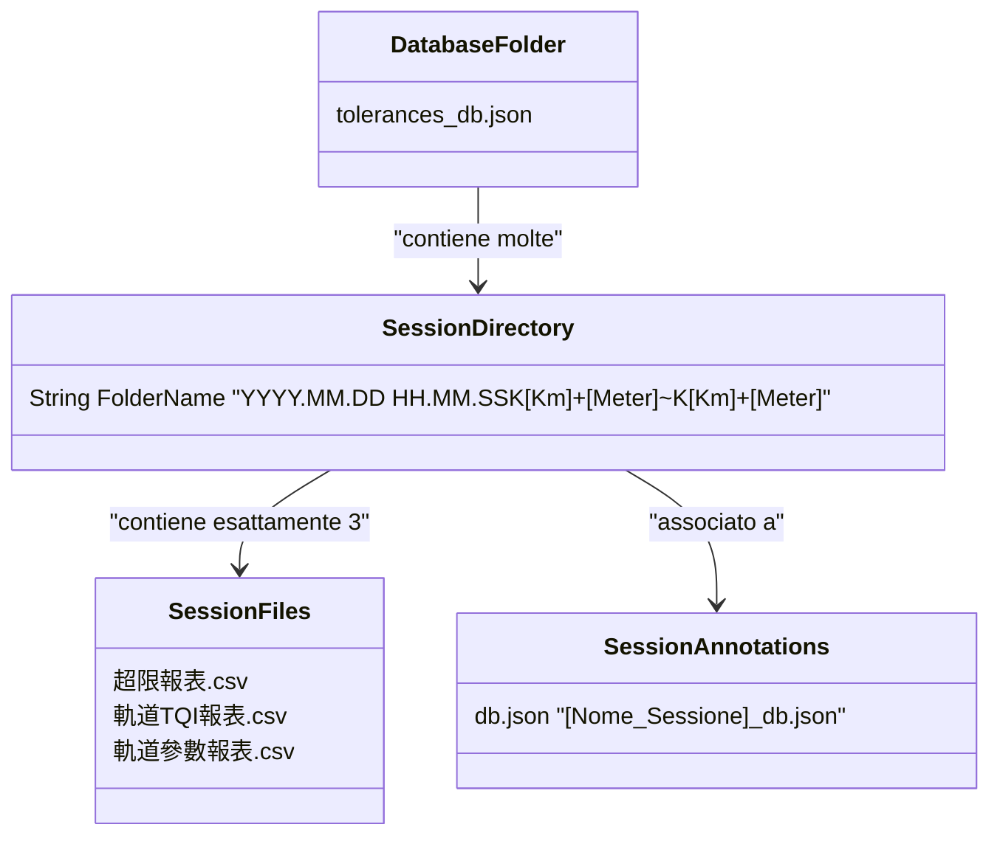

# Specifiche Database: Modulo TGM (Track Geometry Measurement)

Questo documento descrive lo schema e la struttura del database orientato al file system utilizzato dal modulo **TGM (Track Geometry Measurement)** per la gestione delle sessioni di rilievo geometrico del binario, indici TQI, eccedenze e tolleranze.

---

## 1. Informazioni Generali
* **Tipo di Database**: File-system Database (NoSQL a file)
* **Cartella Database principale**: `E:/Software/track_web-main/database/`
* **Scopo**: Organizzare e memorizzare i rilievi geometrici della rotaia in base alla convenzione temporale e chilometrica, contenendo i dati di dettaglio in formato CSV e le configurazioni/annotazioni in formato JSON.

---

## 2. Struttura del Database a File System (Sessioni)

Ogni sessione di rilievo è contenuta in una directory dedicata sotto la radice `database/`, denominata secondo il seguente pattern:

`YYYY.MM.DD HH.MM.SSK[Km]+[Meter]~K[Km]+[Meter]`

### Dettaglio del Nome Cartella (Metadati della Sessione):
* **`YYYY.MM.DD`**: Data di inizio del rilievo (es. `2026.02.27`).
* **`HH.MM.SS`**: Ora di inizio del rilievo (es. `00.22.18`).
* **`K[Km]+[Meter]`**: Progressiva chilometrica in formato ferroviario a 3 cifre per i chilometri e 3 cifre per i metri (es. `K100+000` = Km 100 e metri 000).
* **Punto di Partenza**: Corrisponde alla prima progressiva chilometrica (precedente il carattere `~`).
* **Punto di Arrivo**: Corrisponde alla seconda progressiva chilometrica (successiva al carattere `~`).

---

## 3. Struttura Interna della Directory di Sessione

Ogni directory di sessione contiene esattamente **3 file CSV** specifici:

### 3.1 Report delle Eccedenze (超限報表)
* **Nome File**: `YYYY.MM.DD HH.MM.SS超限報表.csv`
* **Contenuto**: I record delle eccedenze (superamenti delle soglie di tolleranza) riscontrati durante il rilievo per i vari parametri geometrici.

### 3.2 Report TQI (軌道TQI報表)
* **Nome File**: `YYYY.MM.DD HH.MM.SS軌道TQI報表.csv`
* **Contenuto**: Sintesi degli indici TQI (Track Quality Index) calcolati su sezioni di binario per misurare la qualità geometrica complessiva della linea.

### 3.3 Report Parametri Geometrici (軌道參數報表)
* **Nome File**: `YYYY.MM.DD HH.MM.SS軌道參數報表.csv`
* **Contenuto**: Contiene i dati campionati di dettaglio e tutti i parametri geometrici completi misurati lungo la tratta (es. sopraelevazione, scartamento, twist, allineamento, livellamento, ecc.).

---

## 4. File di Configurazione e Annotazione (JSON)

Nella directory principale `database/` risiedono dei file JSON ausiliari che svolgono il ruolo di tabelle di configurazione o tabelle di annotazione:

### 4.1 Database delle Tolleranze (`tolerances_db.json`)
Svolge il ruolo di tabella di configurazione globale per le tolleranze dei parametri geometrici del modulo TGM.
* **Percorso**: `database/tolerances_db.json`
* **Struttura**: Un oggetto JSON contenente le soglie per i vari parametri geometrici (es. Sopraelevazione, Scartamento, Twist Corto).
* **Esempio**:
  ```json
  {
    "Sopraelevazione": 10.1,
    "Scartamento": 10,
    "Twist Corto": 20
  }
  ```

### 4.2 Database delle Singolarità / Annotazioni (`[Nome_Sessione]_db.json`)
Svolge il ruolo di tabella di annotazione per registrare punti singolari, ostacoli o note chilometriche associate a uno specifico rilievo.
* **Percorso**: `database/[Nome_Sessione]_db.json` (es. `2026-06-09_Padova_Milano_db.json`)
* **Struttura**: Un array di oggetti JSON contenenti note georeferenziate tramite la progressiva chilometrica.
* **Esempio**:
  ```json
  [
    {
      "km": "5514.125",
      "type": "Passaggio a livello",
      "icon": "🚧"
    }
  ]
  ```

---

## 5. Diagramma Logico della Struttura a File


